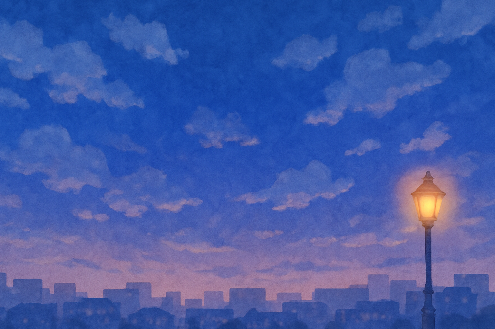
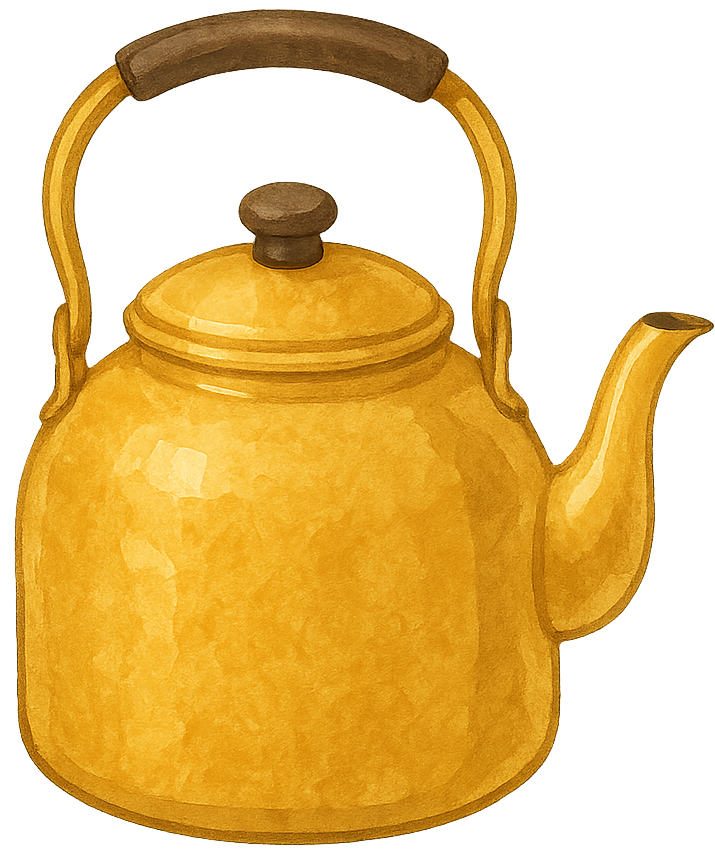
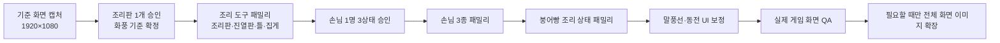

# 따끈따끈 붕어빵 아트 리소스 재생성 계획

> 붕어빵 몸체, 굽기 5구간, 맛 8종, 특별 영혼 8종과 PC 조리 UI의 최신 시각 기준은 [`08_BUNGEOPPANG_ART_AND_COOKING_SYSTEM.md`](./08_BUNGEOPPANG_ART_AND_COOKING_SYSTEM.md)를 따른다.

> **목적:** 현재 Unity 프로젝트의 아트 리소스를 한 가지 시각 언어로 정리하고, 다시 생성해야 할 파일과 그대로 유지할 파일을 구분한다.  
> **결론:** 모든 이미지를 다시 만들 필요는 없다. 먼저 **조리 도구 → 손님 → 붕어빵 상태 → 일부 UI** 순서로 교체하면 적은 작업으로 가장 큰 통일성 개선을 얻을 수 있다.

---

## 1. 한눈에 보는 결정

| 구분 | 결정 |
| --- | --- |
| 기준 화풍 | 따뜻한 겨울 저녁의 손그림 수채화·과슈풍 |
| 가장 먼저 다시 생성 | `cookingPlate.png`, `displayPlate.png`, 활성 조리 틀, `tongs.png` |
| 같은 묶음으로 다시 생성 | 손님 3종, 붕어빵 조리 상태, 일부 UI 아이콘 |
| 유지할 기준 이미지 | `background.png`, `kettle.png`, `fillings.png`, `fillingChunks.png`, `cover.png` |
| 생성보다 먼저 고칠 설정 | `MiJu.asset` 이미지 연결, 활성 조리 틀 프리팹, UI 기준 해상도, 말풍선 PPU |
| 정리 후보 | 미사용 `mold.png`, 미사용 `order_sheet.png`, 미사용 프리팹과 시트 프레임 |

### 우선순위 뜻

- **P0 — 즉시:** 지금 화면에서 가장 크게 이질적이거나, 새 이미지를 넣기 전에 연결부터 고쳐야 하는 항목
- **P1 — 다음:** 자주 보이며 게임 인상을 크게 바꾸는 항목
- **P2 — 선택:** 현재도 사용할 수 있지만, 최종 완성도를 높일 때 정리할 항목

---

## 2. 조사 범위와 확인 방법

- 실제 실행 프로젝트: `BungeoppangTycoon/`
- Unity 버전: `BungeoppangTycoon/ProjectSettings/ProjectVersion.txt` 기준 **6000.3.21f1**
- 조사한 런타임 PNG: `BungeoppangTycoon/Assets/Resources/` 아래 **28개**
- PNG 원본 총용량: 약 **50.65 MiB**
- 확인 항목:
  - 전체 이미지 비교 시트
  - PNG 크기와 투명 배경 여부
  - Unity `.meta`의 Sprite Mode, 슬라이스, PPU, 필터, 밉맵
  - 씬·프리팹·ScriptableObject의 GUID 연결
  - `Resources.Load`로 동적 로드되는 엔딩·조리 상태 이미지
  - 실제 코드가 사용하는 스프라이트 시트 인덱스

> TextMesh Pro가 제공하는 `EmojiOne.png`는 프로젝트 고유 아트가 아니므로 조사 대상에서 제외했다. PNG 외에 PSD, Aseprite 같은 편집 가능한 원본 파일은 발견되지 않았다.

---

## 3. 현재 아트의 강점과 문제

### 잘 잡혀 있는 방향

현재 프로젝트의 가장 좋은 방향은 다음 이미지에서 보이는 **부드러운 수채화 질감, 겨울 저녁의 푸른 배경, 따뜻한 주황빛 음식과 조명**이다.

| 기준 배경 | 기준 소품 |
| --- | --- |
|  |  |

이 방향은 `fillings.png`, `fillingChunks.png`, 손님 캐릭터, 인트로와 엔딩 장면에도 어느 정도 이어져 있다.

### 통일성을 깨는 핵심 문제

| 문제 | 근거 | 영향 |
| --- | --- | --- |
| 재질 표현이 서로 다름 | 조리판·진열판·집게는 사진 또는 거친 스캔 질감, 주전자·재료는 수채화 | 한 화면에서 서로 다른 게임의 이미지처럼 보임 |
| 외곽선 규칙이 없음 | `fishMold.png`는 굵은 검정 만화선, `mold.png`는 연필선, 다른 소품은 부드러운 색면 | 같은 금속 도구끼리도 한 묶음으로 보이지 않음 |
| 손님 비율과 크롭이 다름 | 하진 구버전(기존 하영) 380×700, 정현 338×580, 미주 340×700 프레임 | 등장할 때 키·눈높이·몸 비율이 흔들림 |
| 조리 상태와 틀이 한 시트에 섞임 | 활성 틀이 `FishBunState_proto_0`을 회색으로 칠해 사용됨 | 빈 틀과 음식 상태를 독립적으로 수정하기 어려움 |
| 전체 화면 비율이 섞임 | 주요 배경은 1536×1024(3:2), 주 UI는 1920×1080(16:9), 일부 UI 프리팹은 800×600(4:3) | 화면마다 늘어남·잘림·여백 차이가 생길 수 있음 |
| UI 제작 규칙이 섞임 | 수채화 버튼, 매끈한 금화, 그라데이션 말풍선, 굵은 만화 로고가 공존 | 기능은 읽히지만 하나의 UI 세트로 느껴지지 않음 |

---

## 4. 확정할 아트 디렉션

### 시각 언어

| 축 | 규칙 |
| --- | --- |
| 형태 | 모서리가 둥글고 약간 손으로 그린 듯한 형태. 기능에 필요한 실루엣은 단순하게 유지 |
| 선 | 순수 검정의 굵은 외곽선 금지. 어두운 갈색 또는 청회색의 얇고 부드러운 경계 사용 |
| 채색 | 반투명 수채화 번짐 위에 필요한 부분만 불투명 과슈로 정리 |
| 질감 | 종이 결은 약하게. 사진 노이즈, 숯가루 같은 점 노이즈, 금속 실사 질감은 금지 |
| 빛 | 왼쪽 위에서 오는 부드러운 따뜻한 빛. 그림자는 차가운 청회색 |
| 디테일 | 실제 게임 크기에서 보이는 큰 형태를 우선. 확대해야만 보이는 잔무늬는 줄임 |
| 배경 대비 | 플레이 요소는 배경보다 따뜻하고 밝게, 배경은 푸르고 낮은 대비로 유지 |
| UI | 크림색 종이, 옅은 하늘색, 호박색 포인트를 사용하고 장식은 최소화 |

### 기준 팔레트

기존 기준 이미지에서 추출한 색을 시작점으로 사용한다. 아래 색만 써야 한다는 뜻은 아니며, 역할이 같은 색을 흔들리지 않게 유지하기 위한 기준이다.

| 역할 | 색상 |
| --- | --- |
| 겨울밤 진한 파랑 | `#1F49A2` |
| 저녁 중간 파랑 | `#4561A3` |
| 따뜻한 호박색 | `#E09E22` |
| 종이·반죽 크림 | `#F1E5B4` |
| 차가운 중성색 | `#BAC8C5` |
| 어두운 갈색·회색 | `#745D60` |

### 의도적인 예외

`TitleTextImg.png`의 굵은 로고 글자는 브랜드 식별 요소이므로 다른 UI보다 만화적인 선을 유지해도 된다. 단, 이 굵은 외곽선을 조리 도구와 일반 UI 아이콘까지 확장하지 않는다.

---

## 5. 재생성 백로그

### P0 — 조리 도구 패밀리

| 대상 | 현재 문제 | 새 결과물 요구사항 | 처리 |
| --- | --- | --- | --- |
| `Sprites/cookingPlate.png` | 검은 실사 금속과 강한 점 노이즈가 수채화 배경과 충돌 | 위에서 본 조리판, 짙은 청회색 금속, 낮은 노이즈, 부드러운 수채화 가장자리 | **다시 생성** |
| `Sprites/displayPlate.png` | 나무·돌 사진 질감이 강하고 내부 격자가 조리판과 다른 재질 언어 | 따뜻한 나무 또는 법랑 진열판 중 하나로 확정, 조리판과 같은 시점·광원 | **다시 생성** |
| 활성 조리 틀 | `mold_proto 1.prefab`이 `FishBunState_proto_0`을 회색 틀처럼 재사용 | 빈 붕어 모양 금속 틀을 독립 스프라이트로 제작 | **새 기준 자산 생성 후 연결** |
| `Sprites/fishMold.png` | 굵은 검정 만화선. 현재는 씬에서 쓰이지 않는 프리팹에만 연결 | 새 활성 틀의 파일명으로 재사용하거나 구버전으로 보관 | **교체 또는 보관** |
| `Sprites/tongs.png` | 흑백 스케치·스캔 노이즈가 강함 | 따뜻한 반사광이 있는 청회색 금속 집게, 단순한 수채화 명암 | **다시 생성** |

#### 조리 도구 공통 생성 카드

```text
ROLE/PURPOSE: 2D cooking-tycoon gameplay prop
VIEW: orthographic top-down, consistent scale and upper-left light
ART DIRECTION: warm hand-painted watercolor and restrained gouache, rounded silhouette,
soft dark-brown or blue-gray edges, low texture noise
GAME-SCALE READ: recognizable at normal 1920x1080 gameplay view
TECHNICAL OUTPUT: isolated object, transparent background, generous padding
LOCKS: same palette, view, light direction, edge weight, and detail density across the family
EXCLUDE: text, labels, scenery, duplicate objects, pure-black thick outline,
photorealism, photographic grain, charcoal noise, cropped edges, signature
```

#### 제작 메모

- 도구마다 따로 프롬프트를 새로 만들지 말고, 승인된 첫 조리판을 참조 이미지로 사용한다.
- 생성 원본은 1024px 이상으로 만들고, Unity용 파일은 기존 씬의 보이는 크기와 중심점을 유지하도록 외부 도구에서 자른다.
- 빈 틀과 붕어빵 상태는 반드시 별도 파일로 나눈다.

### P1 — 손님 캐릭터 패밀리

대상 파일:

- `Sprites/Customers/HaYoung.png` — 현재 파일명. 하진 아트로 교체한 뒤 Unity 에디터에서 `HaJin.png`로 변경 검토
- `Sprites/Customers/JeongHyun.png`
- `Sprites/Customers/MiJu.png`

현재 세 캐릭터는 모두 수채화 계열이지만, 정현은 허리 위 구도이고 하진의 구버전 이미지는 전신, 미주는 무릎 위 구도라 화면에서 교체될 때 비율이 흔들린다. 하진은 이름·나이·이야기가 모두 바뀌었으므로 기존 하영 이미지를 유지하지 않고 중학생 영화감독 지망생 아트로 다시 만든다.

#### 통일 규격

| 항목 | 규격 |
| --- | --- |
| 상태 | 기본 / 만족 / 실망 또는 화남, 정확히 3개 |
| 구도 | 정면에 가까운 3/4 시점, 무릎 위 또는 전신 중 하나로 통일 |
| 프레임 | 개별 상태 384×704 기준, 투명 PNG |
| 패킹 | 개별 상태를 검수한 뒤 3장을 1152×704 시트로 조립 |
| 기준점 | 모든 상태의 발 또는 하단 중심점과 눈높이를 고정 |
| 유지 요소 | 얼굴, 헤어스타일, 복장, 가방, 색상, 체형 |
| 표정 차이 | 128px 높이로 축소해도 기본·만족·화남이 구분되어야 함 |

```text
ROLE/PURPOSE: customer character for a 2D winter street-food management game
SUBJECT: the same named customer in exactly three reaction states: neutral, satisfied, upset
VIEW: consistent front three-quarter view, identical crop, eye line, body scale, and baseline
ART DIRECTION: warm hand-painted watercolor with light gouache cleanup,
soft brown linework, simple readable facial features
TECHNICAL OUTPUT: each state isolated on transparent background, no overlap
LOCKS: identity, face, hair, body proportions, clothing, accessories, palette, light, line weight
EXCLUDE: text, speech bubbles, props not already part of the outfit, extra characters,
pose drift, cropped hands, photorealism, signature
```

> **연결 문제:** `MiJu.asset`의 `image` 값이 `{fileID: 0}`으로 비어 있다. 미주는 무작위 손님 목록에 포함되어 있으므로, 새 시트를 만들기 전에도 `MiJu_0` 스프라이트 연결을 복구해야 한다.

### P1 — 붕어빵 조리 상태 패밀리

대상 파일:

- `Sprites/FishBunState_proto.png`
- `Sprites/fishBun_proto.png`

현재 시트에는 빈 틀처럼 쓰는 회색 붕어, 둥근 반죽, 여러 굽기 단계가 섞여 있고 일부 프레임은 코드에서 쓰이지 않는다. 역할을 다음처럼 분리한다.

| 새 패밀리 | 필요한 상태 |
| --- | --- |
| 빈 조리 틀 | 빈 금속 틀 1개 |
| 붕어빵 조리 상태 | 아랫반죽 / 윗반죽 / 1차 굽기 / 완벽하게 구움 / 탐 |
| 완성품 | 진열·드래그용 완성 붕어빵 1개. 조리 상태의 완성본과 같은 형태 사용 |
| 속재료 | 기존 `fillingChunks.png` 8종 유지 |

코드 기준으로 `FishBunState_proto`의 1, 2, 4, 5, 7번 프레임이 조리 과정에서 사용되고, 0번은 활성 틀 프리팹이 사용한다. 3번과 6번은 현재 흐름에서 사용되지 않는다. 인덱스를 바로 삭제하면 코드가 어긋나므로, 새 이름 기반 구조로 옮긴 뒤 정리한다.

#### 검수 기준

- 모든 단계에서 붕어의 머리·꼬리·몸통 위치가 움직이지 않는다.
- 익을수록 명도와 채도가 자연스럽게 변하지만 외곽 크기는 같다.
- 완벽 상태와 탄 상태가 게임 크기에서도 즉시 구분된다.
- 속재료가 올라갈 중앙 영역을 비워 두고 `fillingChunks.png`와 겹쳐 확인한다.
- 생성된 시트를 그대로 믿지 말고, 개별 상태를 같은 캔버스와 중심점으로 다시 조립한다.

### P1 — UI 보정 패밀리

| 대상 | 현재 문제 | 권장 결과 |
| --- | --- | --- |
| `UI/DialogueBallon.png` | 매끈한 노란 그라데이션과 하늘색 선이 다른 수채화 UI와 다름. PPU도 1000으로 예외 | 크림 종이 수채화 패널. 말풍선 꼬리를 포함하고 9-slice가 가능한 단순 테두리 |
| `UI/coin.png` | 매끈한 금속·엠보싱 표현과 푸른 외곽 링이 다소 이질적 | 단순한 호박색 수채화 동전. 작은 크기에서 읽히는 `C` 또는 무문양 중 하나로 확정 |

`arrowButton.png`와 `setting.png`는 현재 UI 방향의 기준으로 유지한다. UI의 글자·숫자는 이미지에 굽지 않고 TextMesh Pro로 표시한다.

### P2 — 전체 화면 이미지

| 대상 | 현재 판단 | 권장 처리 |
| --- | --- | --- |
| `Environment/background.png` | 아트 방향의 핵심 기준 | **유지**. 필요하면 16:9 확장 편집만 수행 |
| `UI/cover.png` | 겨울밤 수채화 방향과 잘 맞음 | **유지**. 1920×1080 안전 영역에 맞게 확장 |
| `UI/storeBackground.png` | 단순하고 따뜻한 UI 배경으로 적합 | **유지**. 16:9 기준으로 다시 배치 |
| 엔딩 3종 | 서로 같은 회화 계열이며 감정별 색 구분도 좋음 | **유지 우선**. 화면 비율과 붕어빵 가게 디자인만 통일 편집 |

이 묶음은 새로 그리기보다 기존 그림을 기준으로 1920×1080 캔버스에 확장·재배치하는 편이 위험이 적다. 조리 화면과 손님을 교체한 뒤 플레이 캡처에서 정말 이질적일 때만 전체 재생성을 진행한다.

---

## 6. 다시 생성하지 않고 유지할 파일

| 파일 | 이유 |
| --- | --- |
| `Materials/steam.png` | 부드러운 투명 증기 효과로 현재 방향과 충돌하지 않음 |
| `Sprites/Environment/background.png` | 전체 팔레트와 겨울밤 분위기의 기준 |
| `Sprites/Environment/bin.png` | 수채화 질감과 단순한 실루엣이 적합 |
| `Sprites/Environment/desk.png` | 낮은 대비의 수채화 작업대라 플레이 요소를 방해하지 않음 |
| `Sprites/fillings.png` | 재료별 색 구분과 수채화 질감이 명확 |
| `Sprites/fillingChunks.png` | 주문 UI와 조리 화면에서 읽기 쉬움 |
| `Sprites/kettle.png` | 따뜻한 호박색과 수채화 재질의 좋은 기준 소품 |
| `Sprites/UI/arrowButton.png` | 종이 질감과 단순한 기호가 UI 방향에 적합 |
| `Sprites/UI/setting.png` | 하늘색 수채화 패널과 크림색 선의 대비가 적합 |
| `Sprites/UI/TitleTextImg.png` | 브랜드 로고로서 의도적인 예외를 허용 |

> 유지 파일도 새 패밀리와 함께 실제 게임 크기로 배치해 확인한다. 단독으로 보기 좋다는 이유만으로 최종 승인을 하지 않는다.

---

## 7. 이미지 생성 전에 고칠 Unity 연결과 설정

### 반드시 확인

1. **미주 스프라이트 연결 복구**  
   `Resources/Data/SO/MiJu.asset`의 `image`가 비어 있다. `MiJu_0`을 기본 이미지로 연결한다.

2. **활성 조리 틀 프리팹 통합**  
   `GameScene.unity`는 `mold_proto 1.prefab`을 사용하며, 이 프리팹은 `FishBunState_proto_0`을 회색으로 칠해 틀처럼 사용한다. 씬에서 쓰이지 않는 `mold_proto.prefab`과 하나로 합치고, 새 빈 틀 스프라이트를 연결한다.

3. **UI 기준 해상도 통일**  
   주 화면은 1920×1080인데 일부 UI 프리팹은 800×600을 기준으로 한다. 새 전체 화면 이미지를 만들기 전에 최종 기준을 1920×1080으로 확정한다.

4. **말풍선 PPU 통일**  
   대부분의 스프라이트는 100 PPU인데 `DialogueBallon.png`만 1000 PPU다. 9-slice UI로 전환하고 PPU 또는 Canvas 사용 방식을 한 가지로 맞춘다.

5. **파일명에서 `_proto` 제거 계획**  
   최종 교체가 끝나면 `fishBun_proto`, `FishBunState_proto`, `mold_proto 1` 같은 임시 이름을 역할 중심 이름으로 바꾼다. Unity 에디터에서 이동·이름 변경해 `.meta` 연결을 보존한다.

### 현재 Import 설정에서 유지할 것

- 수채화 그림이므로 `Filter Mode: Bilinear` 유지
- UI·2D Sprite는 `Texture Type: Sprite` 유지
- 불필요한 런타임 픽셀 접근이 없으므로 Read/Write 비활성 유지
- 투명 스프라이트는 Alpha Is Transparency 유지

### 교체 후 다시 결정할 것

- PPU는 같은 화면 역할끼리 동일하게 설정
- 큰 전체 화면 이미지는 플랫폼별 Max Size와 압축 품질을 따로 확인
- UI 패널은 9-slice Border를 설정하고 여러 크기로 늘려 모서리 왜곡 확인
- Tight Mesh가 작은 장식에 불필요한 콜라이더 또는 형태 변화를 만들지 확인

---

## 8. 정리·보관 후보

| 항목 | 확인된 상태 | 권장 조치 |
| --- | --- | --- |
| `Sprites/mold.png` | 직렬화 참조와 코드 로드가 확인되지 않음 | 새 틀 교체 후 보관 또는 삭제 후보 |
| `Sprites/fishMold.png` | 씬에서 사용하지 않는 `mold_proto.prefab`에만 연결 | 새 기준 틀로 교체하거나 구버전 폴더로 이동 |
| `UI/order_sheet.png` | 직렬화 참조와 코드 로드가 확인되지 않음 | 실제 미사용 확인 후 보관 |
| `Resources/Prefabs/mold_proto.prefab` | `GameScene`에서 직접 사용되지 않음 | 활성 프리팹과 통합 후 정리 |
| `fillingChunks.png` 9번째 슬라이스 | `FillingType`은 8종이므로 인덱스 8은 현재 미사용 | 코드·데이터 확인 후 제거 또는 미래 재료로 명시 |
| `FishBunState_proto` 3·6번 슬라이스 | 현재 조리 코드에서 사용되지 않음 | 인덱스 기반 로드를 이름 기반으로 바꾼 뒤 정리 |

> 삭제는 이 문서 단계에서 하지 않는다. Unity 에디터에서 Missing Reference가 없는지 확인하고 별도 정리 작업으로 진행한다.

---

## 9. 권장 제작 순서



### 작업 체크리스트

- [ ] 1920×1080 실제 게임 화면을 기준 캡처로 남긴다.
- [ ] `background + kettle + fillingChunks + customer + UI`가 함께 보이는 스타일 보드를 만든다.
- [ ] 첫 조리판을 실제 게임 크기로 승인한다.
- [ ] 승인된 조리판을 참조로 나머지 도구를 같은 묶음으로 생성한다.
- [ ] 손님 한 명의 3상태를 먼저 승인한 뒤 나머지 두 명을 만든다.
- [ ] 개별 프레임을 동일 캔버스·중심점으로 정규화한다.
- [ ] 기존 파일을 덮기 전에 `ArtSource` 또는 별도 원본 폴더에 생성 원본을 보관한다.
- [ ] Unity에서 PPU, Pivot, Collider, Sorting Order를 확인한다.
- [ ] 1920×1080, 작은 창, 전체 화면에서 각각 확인한다.
- [ ] 프롬프트, 생성 도구, 날짜, 편집 이력을 함께 기록한다.

---

## 10. 승인 기준

### 시각 통일성

- [ ] 조리 도구에 사진 질감 또는 숯가루 같은 검은 점 노이즈가 없다.
- [ ] 같은 금속 소품은 같은 청회색, 같은 광원, 같은 경계선을 사용한다.
- [ ] 모든 손님의 눈높이와 화면 점유율이 비슷하다.
- [ ] 붕어빵 상태가 바뀌어도 실루엣과 중심점이 움직이지 않는다.
- [ ] UI 아이콘은 수채화 종이·크림·하늘색·호박색 규칙 안에 있다.

### 게임에서의 가독성

- [ ] 도구와 붕어빵이 푸른 배경 위에서 즉시 구분된다.
- [ ] 만족·실망 표정이 축소된 크기에서도 읽힌다.
- [ ] 완벽하게 구운 상태와 탄 상태를 색만이 아니라 명도·질감으로도 구분한다.
- [ ] 말풍선이 늘어나도 모서리와 꼬리가 찌그러지지 않는다.

### 기술 검수

- [ ] PNG 투명 배경의 가장자리에 흰색 또는 검은색 테두리가 없다.
- [ ] 스프라이트의 Pivot과 PPU가 같은 패밀리에서 일치한다.
- [ ] 교체 전후 콜라이더와 클릭 영역이 기능적으로 같다.
- [ ] 시트 슬라이스 이름과 코드 상태 이름이 일치한다.
- [ ] Missing Sprite와 Missing Reference가 없다.
- [ ] WebGL 빌드에서 압축 깨짐과 과도한 메모리 사용이 없다.

---

## 11. 전체 리소스 판정표

| 리소스 | 판정 | 우선순위 | 핵심 조치 |
| --- | --- | --- | --- |
| `Materials/steam.png` | 유지 | — | 현재 증기 효과 유지 |
| `Sprites/cookingPlate.png` | 재생성 | P0 | 수채화 청회색 조리판 |
| `Sprites/Customers/HaYoung.png` → `HaJin.png` | 설정 변경 재생성 | P1 | 중학교 교복·카메라·스토리보드, 동일 프레임·눈높이·3상태 |
| `Sprites/Customers/JeongHyun.png` | 패밀리 재생성 | P1 | 전신 비율과 크롭 통일 |
| `Sprites/Customers/MiJu.png` | 패밀리 재생성 + 연결 수정 | P1/P0 | 새 3상태와 `MiJu.asset` 연결 |
| `Sprites/displayPlate.png` | 재생성 | P0 | 조리판과 같은 시점·광원 |
| `Sprites/Ending/ClearEndingScene.png` | 유지·비율 보정 | P2 | 16:9 확장, 가게 디자인 유지 |
| `Sprites/Ending/NormalEndingScene.png` | 유지·비율 보정 | P2 | 16:9 확장, 같은 가게 유지 |
| `Sprites/Ending/OverEndingScene.png` | 유지·비율 보정 | P2 | 16:9 확장, 같은 가게 유지 |
| `Sprites/Environment/background.png` | 기준 유지 | — | 핵심 배경 레퍼런스 |
| `Sprites/Environment/bin.png` | 유지 | — | 필요 시 색만 미세 조정 |
| `Sprites/Environment/desk.png` | 유지 | — | 낮은 대비 유지 |
| `Sprites/fillingChunks.png` | 유지·슬라이스 정리 | — | 8종 사용, 9번째 프레임 확인 |
| `Sprites/fillings.png` | 유지 | — | 재료 8종 기준 레퍼런스 |
| `Sprites/fishBun_proto.png` | 패밀리 재생성 | P1 | 완성 상태 기준 이미지로 통합 |
| `Sprites/FishBunState_proto.png` | 재생성·분리 | P1 | 틀과 음식 상태 분리, 프레임 고정 |
| `Sprites/fishMold.png` | 새 기준으로 교체 | P0 | 활성 빈 틀 스프라이트로 사용 |
| `Sprites/kettle.png` | 기준 유지 | — | 조리 도구 색·질감 레퍼런스 |
| `Sprites/mold.png` | 정리 후보 | — | 미사용 확인 후 보관 |
| `Sprites/tongs.png` | 재생성 | P0 | 수채화 금속 집게 |
| `Sprites/UI/arrowButton.png` | 기준 유지 | — | 종이 질감 UI 레퍼런스 |
| `Sprites/UI/coin.png` | 재생성 | P1 | 수채화 호박색 아이콘 |
| `Sprites/UI/cover.png` | 유지·비율 보정 | P2 | 1920×1080 안전 영역 적용 |
| `Sprites/UI/DialogueBallon.png` | 재생성 | P1 | 수채화 9-slice 패널, PPU 정리 |
| `Sprites/UI/order_sheet.png` | 정리 후보 | — | 미사용 확인 후 보관 |
| `Sprites/UI/setting.png` | 기준 유지 | — | 하늘색 UI 레퍼런스 |
| `Sprites/UI/storeBackground.png` | 유지·비율 보정 | P2 | 16:9 배치만 정리 |
| `Sprites/UI/TitleTextImg.png` | 브랜드 예외 유지 | — | 로고 외 다른 자산에 굵은 선 확산 금지 |

---

## 12. 최종 권장 범위

첫 번째 교체 작업은 다음 **11개 파일·역할**로 제한한다.

1. `cookingPlate.png`
2. `displayPlate.png`
3. 활성 빈 조리 틀 (`fishMold.png`를 새 기준 파일로 사용 권장)
4. `tongs.png`
5. `HaJin.png` — 기존 `HaYoung.png` 연결을 안전하게 이전
6. `JeongHyun.png`
7. `MiJu.png`
8. `FishBunState_proto.png`
9. `fishBun_proto.png`
10. `DialogueBallon.png`
11. `coin.png`

이 1차 범위를 실제 게임 화면에서 승인한 뒤에만 배경·인트로·엔딩의 16:9 확장 작업으로 넘어간다. 이렇게 하면 이미 잘 맞는 수채화 자산을 버리지 않으면서, 플레이 중 가장 자주 보이는 이질적인 요소부터 제거할 수 있다.
